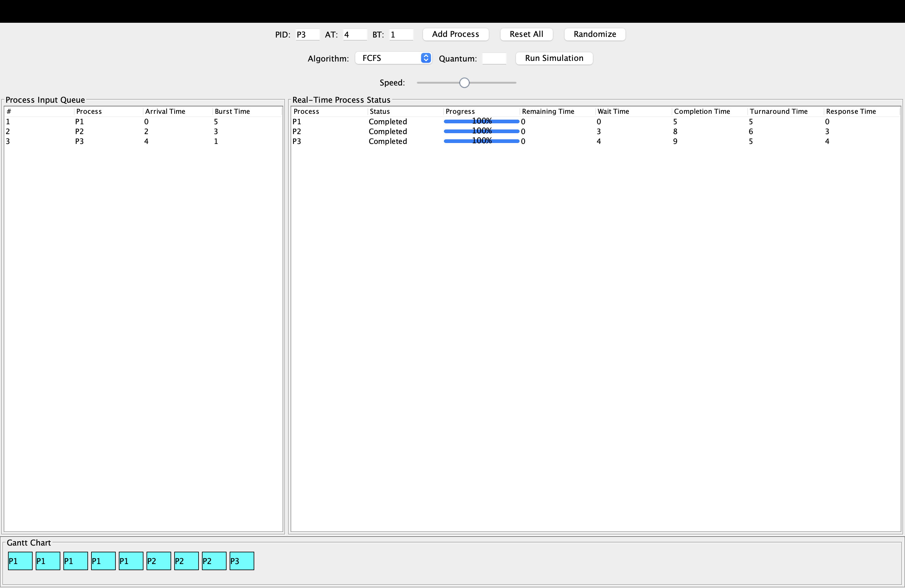
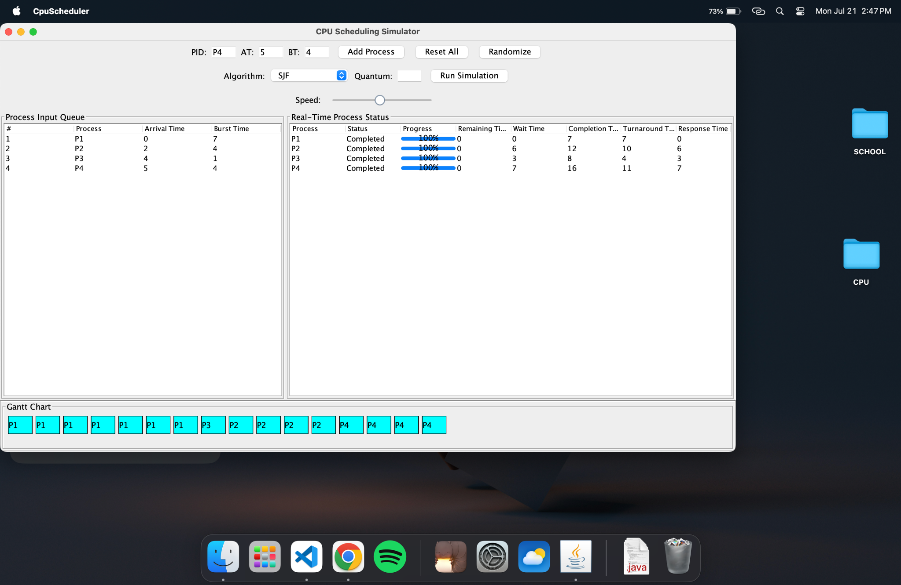
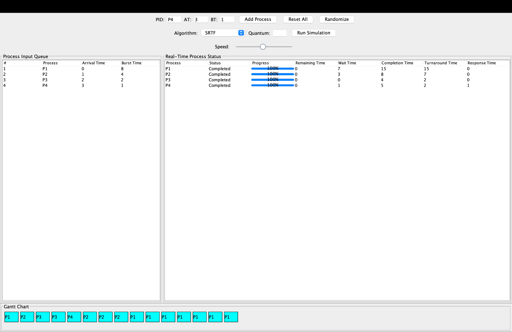
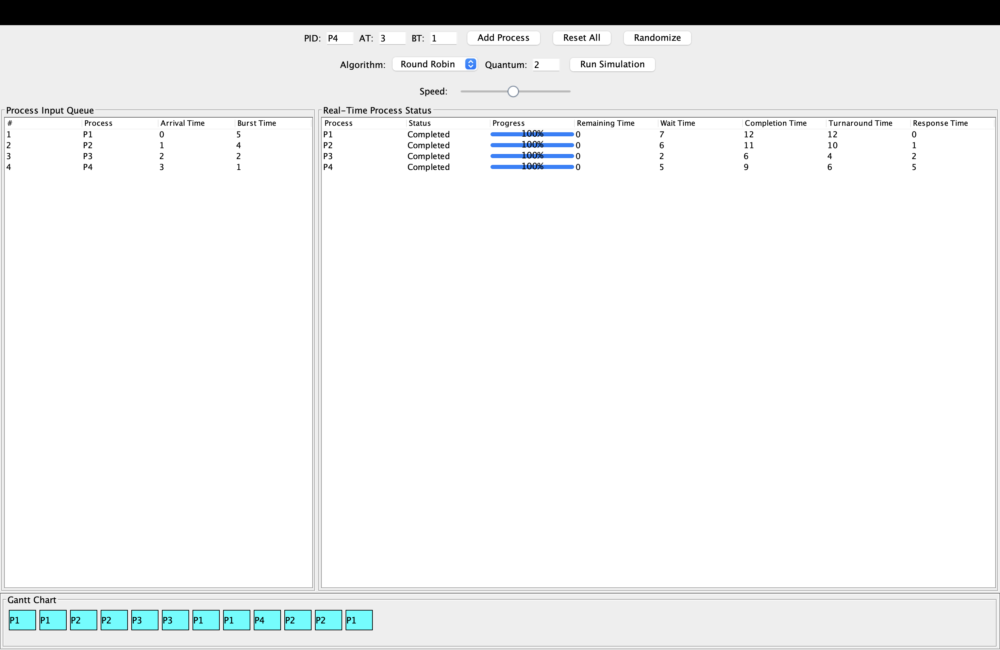
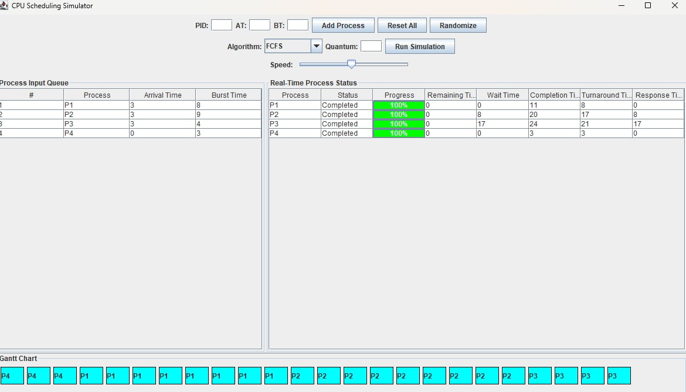

PROJECT OVERVIEW: CPU SCHEDULING VISUALIZATION SIMULATOR
 - This project is a comprehensive CPU Simulator and Visualizer developed using Java Swing. It provides a detailed and interactive interface to visualize how different CPU scheduling algorithms work, along with computed metrics per process such as Completion Time, Turnaround Time, Wait Time and Response Time. It also computed the average Turnaround Time and the Response Time.

 
 OBJECTIVE
The goal of this simulator is to provide both educational and practical insight into CPU scheduling algorithms by:
 - Simulating how processes are scheduled on a single-core CPU
 - Visually representing process execution via Gantt Charts
 - Displaying real-time progress, statuses, and metrics
 - Offering both manual input and random process generation
 - Allowing the user to select from five scheduling algorithms, including advanced multilevel scheduling

IMPLEMENTED SCHEDULING ALGORITHM
 - First-Come First-Served (FCFS)
 - Shortest Job First (SJF) – Non-preemptive
 - Shortest Remaining Time First (SRTF) – Preemptive
 - Round Robin – with user-defined time quantum
 - Multilevel Feedback Queue (MLFQ) – with configurable time slices and allotments per level (Q0–Q3)

KEY FEATURES
 - Graphical User Interface
     - Process input panel
     - Real-time progress bar and status bar
     - Interactive Gantt Chart
     - Adjustable simulation speed (via slider)

 - Manual or Randomized Input: Users can input processes or auto-generated them

 - Real-Time Visualization: 
     - Gantt chart updates every time unit
     - Color-coded progress and labels

 - Metrics Calculation per Process:
     - Arrival Time, Burst Time
     - Completion Time, Turnaround Time
     - Response Time, Waiting Time

 - Average Metrics Display (planned as part of output summary)

 - MLFQ Configuration:
     - 4 Priority Levels: Q0 (highest) to Q3 (lowest)
     - Prompts for custom time slice and allotment per queue
     - Prompts for custom levels classification

TECHNOLOGIES USED
 - Java17
 - Swing Framework
 - OOP Design with MVC Elements
 - JTable, JProgressBar, JSlider for interactive components 

 DIRECTORY STRUCTURE 
 package1/
│
├── CpuScheduler.java     // Main GUI and simulation logic
├── Process.java          // Data model for process state and metrics
├── Gantt.java            // Handles the core logic for CPU scheduling      algorithms and manages process execution flow, calculating key metrics such as waiting time, turnaround time, and response time. where should i put tthis
├── Simulation.java       // Represents individual processes with attributes such as arrival time, burst time, and their respective states during simulation (e.g., running, completed).

SAMPLE INPUTS AND OUTPUTS
 - Process P1, P2, P3 with various Arrival/Burst Times
 - Output: 
     Gantt chart | P1 | P1 | P2 | P2 | P3 |
     Status Table: dynamic progress bar and final metrics
     Console output/logs 

CONTRIBUTORS
 - This project is developed as part of Project 01 for Operating Systems
 - TEAM MEMBERS: 
     - Jer Erick Dumalagan - gui, algo (everything).
     - John Brendan Lumicday - algo(mlfq, rr), readme, gui.
     Repository: https://github.com/Brendanyyy/CPU-SCHEDULER.git

KNOWN LIMITATIONS
 - Metrics summary averages are not yet printed in GUI
 - No process dynamic arrival post-start
 - No context switching delays modeled
 - Only runs on desktop (Swing)
 - All processes are assumed to arrive at the start; dynamic arrivals during runtime are not yet handled
 - GUI is responsive but not optimized for small screens
 - MLFQ scheduling has complications in the GUI:
    - While the logic works correctly in the background, the live visual representation (Gantt chart and status table) may not always reflect MLFQ scheduling behavior accurately.
    - Some Gantt transitions or queue demotions may not display in real-time due to GUI update limitations

INSTRUCTIONS ON HOW TO RUN THE SIMULATION

REQUIREMENTS:
     - Java 17 or later versions
     - Any IDE (IntelliJ, NetBeans, Eclipse, Visual Studio Code) or terminal with Java support

STEPS
 - 1. Clone the repository: git clone https://github.com/your-username cpu-scheduling-visualizer.git cd cpu-scheduling-visualizer

 - 2. Compile the code (if using the terminal): javac package1/*.java

 - 3. Run the program: java package1.CpuScheduler

 - 4. The GUI window will appear
    From here, you can:
         - Manually input or randomly generate processes. 
         - Select the desired algorithm from the dropdown
         - Enter the time quantum (for Round Robin / Multilevel Feedback Queue (MLFQ))
         - Click "Run Simulator" to begin
         - Watch the Gantt Chart and status table update live

SCHEDULING ALGORITHMS DESCRIPTIONS

 - 1. First-Come First-Serve (FCFS)
     - Non-preemptive
     - Processes are scheduled in order of arrival
     - Simple queue-based logic

 - SAMPLE INPUT AND EXPECTED OUTPUT: 
        | Process | Arrival Time | Burst Time |
        | ------- | ------------ | ---------- |
        | P1      | 0            | 5          |
        | P2      | 2            | 3          |
        | P3      | 4            | 1          |
        
 - Gantt Chart:| P1 | P1 | P1 | P1 | P1 | P2 | P2 | P2 | P3 |

 - OUTPUT METRICS:
| Process | Arrival | Burst | Completion | Turnaround | Waiting | Response |
| ------- | ------- | ----- | ---------- | ---------- | ------- | -------- |
| P1      | 0       | 5     | 5          | 5          | 0       | 0        |
| P2      | 2       | 3     | 8          | 6          | 3       | 3        |
| P3      | 4       | 1     | 9          | 5          | 4       | 4        |

 - FINAL RESULT IN GUI:

 - 2. Shortest Job First (SJF)
     - Non-preemptive 
     - Among available processes, the one with the shortest burst time is chosen
     - May causes starvation for long processes

 - SAMPLE INPUT AND EXPECTED OUTPUT: 
    | Process | Arrival Time | Burst Time |
    | ------- | ------------ | ---------- |
    | P1      | 0            | 7          |
    | P2      | 2            | 4          |
    | P3      | 4            | 1          |
    | P4      | 5            | 4          |

 - Gantt Chart: 
 | P1 | P1 | P1 | P1 | P1 | P1 | P1 | P3 | P2 | P2 | P2 | P2 | P4 | P4 |
 P4 | P4 | 
  0    1    2    3    4    5    6    7    8    9   10   11   12   13   
  14   15

 - OUTPUT METRICS: 
| Process | Arrival | Burst | Completion | Turnaround | Waiting | Response |
| ------- | ------- | ----- | ---------- | ---------- | ------- | -------- |
| P1      | 0       | 7     | 7          | 7          | 0       | 0        |
| P2      | 2       | 4     | 12         | 10          | 6       | 6        |
| P3      | 4       | 1     | 8          | 4          | 3       | 3        |
| P4      | 5       | 4     | 16         | 11         | 7       | 7        |

 - FINAL OUTPUT IN GUI: 
    
 - 3. Shortest Remaining Time First (SRTF)
     - Preemptive version of SJF
     - At every time unit, the processes with the least remaining burst time is selected
     - Can switch mid-execution if a shorter job arrives

 - SAMPLE INPUT AND EXPECTED OUTPUT:
    | Process | Arrival Time | Burst Time |
    | ------- | ------------ | ---------- |
    | P1      | 0            | 8          |
    | P2      | 1            | 4          |
    | P3      | 2            | 2          |
    | P4      | 3            | 1          |

 - Gantt Chart: | P1 | P2 | P3 | P3 | P4 | P2 | P2 | P2 | P1 | P1 | P1 | P1 | P1 | P1 | P1 | P1 |
  0    1    2    3    4    5    6    7    8    9   10   11   12   13   14   15

 - OUTPUT METRICS: 
| Process | Arrival | Burst | Completion | Turnaround | Waiting | Response |
| ------- | ------- | ----- | ---------- | ---------- | ------- | -------- |
| P1      | 0       | 8     | 16         | 16         | 8       | 0        |
| P2      | 1       | 4     | 8          | 7          | 3       | 1        |
| P3      | 2       | 2     | 4          | 2          | 0       | 2        |
| P4      | 3       | 1     | 5          | 2          | 1       | 4        |

 - FINAL OUTPUT IN GUI: 

 - 4. Round Robin (RR)
     - Preemptive with fixed time quantum
     - Each processes runs for a time slice; if not done, it goes back to the end of the queue
     - Fair but may cause high context switching

 - SAMPLE INPUT AND EXPECTED OUTPUT:
    | Process | Arrival Time | Burst Time |
    | ------- | ------------ | ---------- |
    | P1      | 0            | 5          |
    | P2      | 1            | 4          |
    | P3      | 2            | 2          |
    | P4      | 3            | 1          |
    TIME QUANTUM: 2

 - Gantt Chart: Time: 0   2   4   6   7   9   10
       | P1 | P2 | P3 | P4 | P1 | P2 |

 - OUTPUT METRICS: 
| Process | Arrival | Burst | Completion | Turnaround | Waiting | Response |
| ------- | ------- | ----- | ---------- | ---------- | ------- | -------- |
| P1      | 0       | 5     | 12         | 12         | 7       | 0        |
| P2      | 1       | 4     | 11         | 10          | 6       | 1        |
| P3      | 2       | 2     | 6          | 4          | 2       | 2        |
| P4      | 3       | 1     | 9          | 6          | 5       | 3        |
    
 - FINAL OUTPUT IN GUI:

    
 - 5. Multilevel Feedback Queue (MLFQ)
     - Uses 4 queues (Q0 to Q3) with decreasing priority
     - Processes start at Q0 and can be demoted if they use too much time
     - Supports different time quantums and allotments per level
     - Attempts to balance fairness, responsiveness, and efficiency

 - SAMPLE INPUT AND EXPECTED OUTPUT:
| Process | Arrival Time | Burst Time |
| ------- | ------------ | ---------- |
| P1      | 3            | 8          |
| P2      | 3            | 9          |
| P3      | 3            | 4          |
| P4      | 0            | 3

 - EXECUTION ORDER:
| Time  | Action            | Queue | Notes                           |
| ----- | ----------------- | ----- | ------------------------------- |
| 0–2   | P4 runs (2 units) | Q0    | P4 not finished                 |
| 2–3   | P4 runs (1 unit)  | Q0    | P4 completes                    |
| 3–5   | P3 runs (2 units) | Q0    | P3 not finished → still in Q0   |
| 5–7   | P1 runs (2 units) | Q0    | P1 not finished → still in Q0   |
| 7–9   | P3 runs (2 units) | Q0    | P3 completes                    |
| 9–11  | P2 runs (2 units) | Q0    | P2 not finished → demoted to Q1 |
| 11–13 | P1 runs (2 units) | Q0    | P1 not finished → demoted to Q1 |
| 13–15 | P2 runs (2 units) | Q1    | P2 not finished                 |
| 15–17 | P1 runs (2 units) | Q1    | P1 not finished                 |
| 17–19 | P2 runs (2 units) | Q1    | P2 not finished                 |
| 19–21 | P1 runs (2 units) | Q1    | P1 completes                    |
| 21–24 | P2 runs (3 units) | Q1    | P2 completes                    | 

 - Gantt Chart:
| P4 | P3 | P1 | P3 | P2 | P1 | P2 | P1 | P2 | P1 | P2 |
|----|----|----|----|----|----|----|----|----|----|----|
| 0  | 3  | 5  | 7  | 9  |11  |13  |15  |17  |19  |21  |24

 - OUTPUT METRICS: 
| Process | Arrival | Burst | Completion | Turnaround | Waiting | Response |
| ------- | ------- | ----- | ---------- | ---------- | ------- | -------- |
| P1      | 3       | 8     | 15         | 12         | 12      | 4        |
| P2      | 3       | 9     | 24         | 21         | 21      | 12       |
| P3      | 3       | 4     | 7          | 4          | 4       | 0        |
| P4      | 0       | 3     | 3          | 3          | 3       | 0        |

 - FINAL OUTPUT IN GUI: 